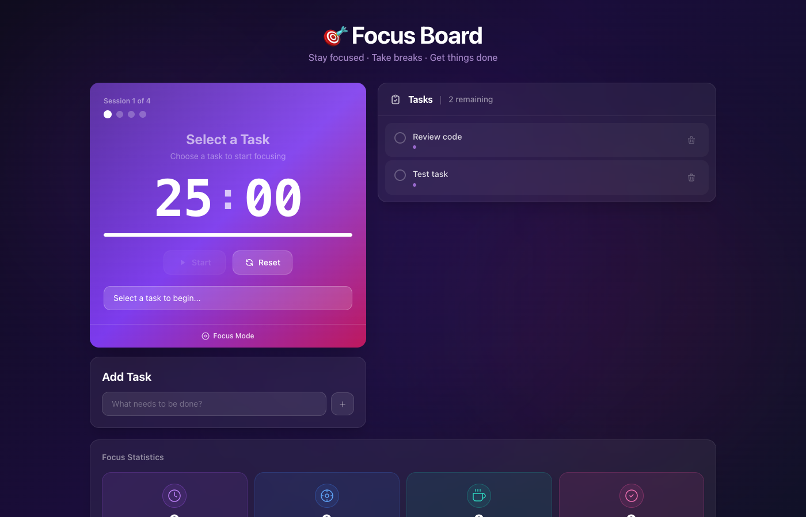
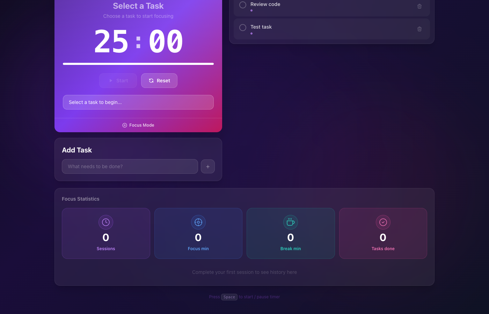

# Focus Board

A modern Pomodoro-style productivity application built with React 18, Vite, and Tailwind CSS. Structure your work into 25-minute focus sessions, manage tasks with optional descriptions, and track your productivity across sessions — all persisted locally in the browser.



---

## Features

- **Pomodoro Timer** — 25-minute focus / 5-minute break cycle with automatic mode switching
- **Pomodoro cycle tracking** — visual "Session X of 4" dots; long-break awareness after 4 sessions
- **Task management** — add tasks with optional descriptions, mark complete, delete; full localStorage persistence
- **Session pips** — each completed focus session is recorded as a dot on the task row
- **Focus statistics** — running totals of sessions, focus minutes, break minutes, and tasks done
- **Session history** — timestamped log of every completed session with a "view all" toggle
- **Global keyboard shortcut** — press `Space` anywhere to start / pause the timer
- **XSS protection** — all user input sanitized with DOMPurify before storage or render
- **Responsive layout** — two-column desktop layout collapses to single column on mobile

---

## Screenshot




---

## Tech Stack

| Layer | Technology |
|---|---|
| UI framework | React 18 |
| Build tool | Vite 5 |
| Styling | Tailwind CSS v3 (JIT, via PostCSS) |
| Security | DOMPurify |
| State | React Hooks + Context API |
| Persistence | localStorage |
| Unit tests | Vitest + React Testing Library |
| E2E tests | Playwright |

---

## Project Structure

```
focusboard/
├── docs/
│   ├── screenshots/         # Reference screenshots (tracked in git)
│   │   ├── app-preview.png  # Full desktop layout
│   │   └── app-stats.png    # Stats bar + session history
│   ├── API.md               # Component & hook API reference
│   ├── CODE_REVIEW.md       # Interdisciplinary code review findings
│   └── PROJECT_OVERVIEW.md  # Architecture decisions and tech notes
├── e2e/
│   └── focusboard.spec.js   # Playwright end-to-end tests
├── src/
│   ├── components/
│   │   ├── App.jsx          # Root layout, keyboard shortcut
│   │   ├── Timer.jsx        # Pomodoro timer card
│   │   ├── TaskForm.jsx     # Add-task form (expandable)
│   │   ├── TaskList.jsx     # Task list with selection
│   │   └── Summary.jsx      # Stats cards + session history
│   ├── context/
│   │   └── TaskContext.jsx  # Shared state provider
│   ├── hooks/
│   │   ├── useTimer.js      # Timer logic + pomodoro counting
│   │   └── useTasks.js      # Task CRUD + localStorage sync
│   ├── constants/
│   │   └── appConstants.js  # Shared magic numbers / strings
│   ├── test/
│   │   ├── setup.js         # Vitest setup (mocks for DOMPurify, localStorage)
│   │   ├── useTimer.test.js # Hook unit tests
│   │   ├── useTasks.test.js # Hook unit tests
│   │   └── components.test.jsx # Component tests
│   ├── index.css            # Tailwind directives + base resets
│   └── main.jsx             # React DOM entry point
├── index.html               # Vite HTML template + CSP header
├── vite.config.js           # Vite + Vitest config
├── postcss.config.js        # PostCSS → Tailwind + Autoprefixer
├── tailwind.config.js       # Tailwind content paths
├── playwright.config.js     # Playwright E2E config
└── package.json
```

---

## Getting Started

### Prerequisites

- Node.js 18+ and npm

### Install & run

```bash
# Install dependencies
npm install

# Start dev server (http://localhost:5173)
npm run dev
```

### Available scripts

| Script | Description |
|---|---|
| `npm run dev` | Start Vite dev server |
| `npm run build` | Production build to `dist/` |
| `npm run preview` | Preview production build |
| `npm test` | Run Vitest unit + component tests |
| `npm run test:watch` | Vitest in watch mode |
| `npm run test:coverage` | Vitest with V8 coverage report |
| `npm run test:e2e` | Run Playwright E2E tests |
| `npm run test:e2e:ui` | Playwright interactive UI mode |

---

## Usage

### Add a task

1. Type a title in the **Add Task** input and press `Enter`, or click `+` to expand and add an optional description.

### Start a focus session

1. Click a task in the list to select it — it highlights in the timer card.
2. Press `Space` (or click **Start**) to begin the 25-minute countdown.
3. The progress bar drains from right to left; a dot is added to the task row when the session completes.

### Controls

| Action | How |
|---|---|
| Start / Resume | `Space` or **Start** button |
| Pause | `Space` or **Pause** button |
| Reset timer | **Reset** button |
| Complete session early | **Complete** button (appears after timer starts) |
| Switch to break | Timer auto-transitions after focus runs out |

### Keyboard shortcut

Press `Space` anywhere on the page (not inside an input) to toggle the timer.

---

## Architecture

### State management

State is split into two custom hooks owned by `TaskContext`, which is provided at the root:

- **`useTimer`** — manages `timeRemaining`, `isActive`, `isFocusMode`, `currentTaskId`, and `pomodoroCount`. The timer runs via a `setInterval` effect that self-clears on unmount or pause.
- **`useTasks`** — manages the `tasks` array with CRUD operations. Reads from and writes to `localStorage` on every mutation.

All children consume state through `useTaskContext()` — no prop drilling.

### Security

- `DOMPurify.sanitize()` is called on every user-supplied string at the point of submission (in `TaskForm`) and again at the point of render (in `Timer`, `TaskList`, `Summary`), providing defense-in-depth against XSS.
- A Content Security Policy meta tag in `index.html` restricts script sources to `'self'`.

---

## Testing

The test suite covers three layers:

| Layer | Files | Coverage |
|---|---|---|
| Hook unit tests | `useTimer.test.js`, `useTasks.test.js` | Timer lifecycle, task CRUD, localStorage sync |
| Component tests | `components.test.jsx` | Render, user interaction, data display |
| E2E tests | `e2e/focusboard.spec.js` | Full user flows in Chromium |

Run all unit + component tests:

```bash
npm test
# → 39 tests, 3 test files, all passing
```

Run E2E tests (requires dev server or auto-starts one):

```bash
npm run test:e2e
```

---

## Design

The UI follows the wireframe developed during the interdisciplinary design review:

- **Two-column desktop layout** — timer + add-task on the left, task list on the right
- **Vivid purple-to-pink gradient** on the timer card in focus mode; teal gradient in break mode
- **Spaced time digits** (`25 : 00`) and session tracker (`Session 1 of 4`) inside the timer card
- **Four stat cards** at the bottom with SVG circle icons and accent colours (purple / blue / teal / pink)
- **Glassmorphism** cards with `backdrop-blur`, semi-transparent backgrounds, and subtle borders throughout

---

## Known Limitations

- Timer durations are fixed (25 min focus / 5 min break) — no settings UI yet
- No audio notification when the timer expires
- Session history is stored in React state only (lost on hard refresh); tasks persist via localStorage
- No multi-user or cloud sync support

---

## License

MIT
